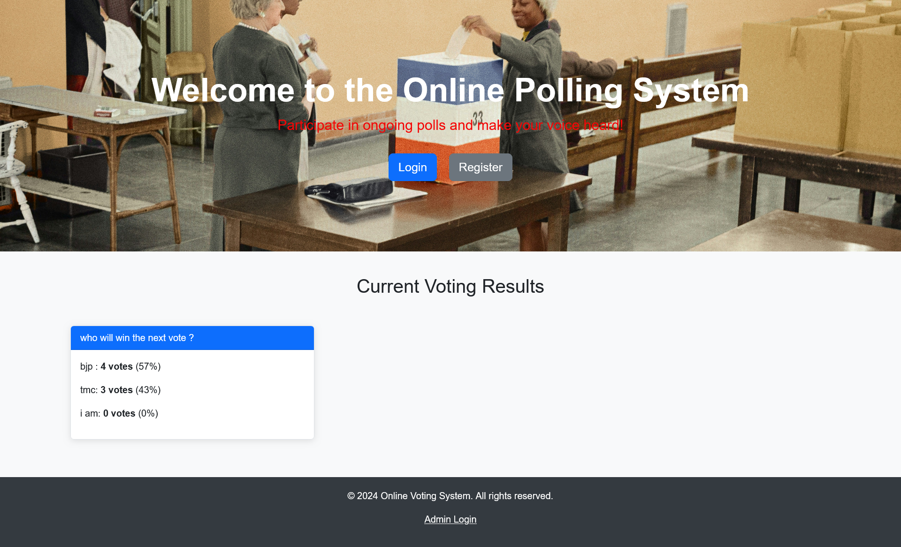
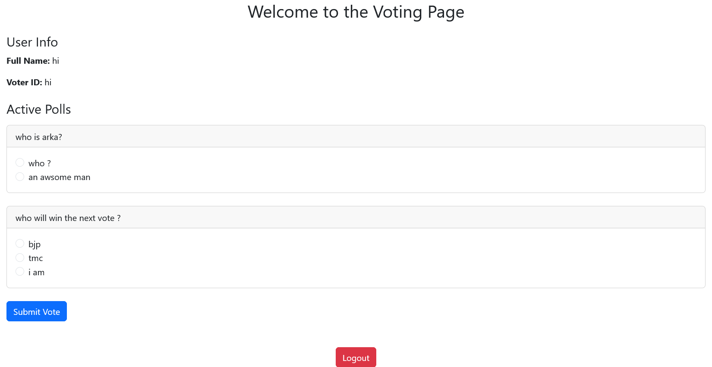
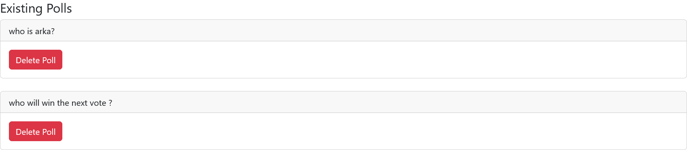
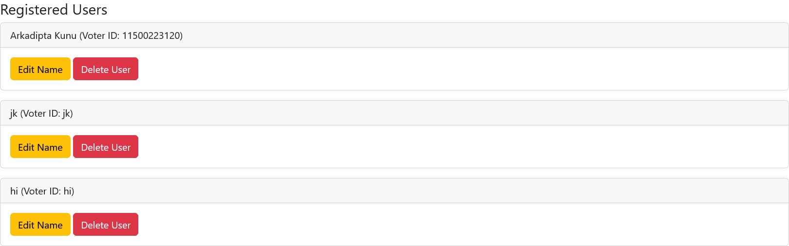
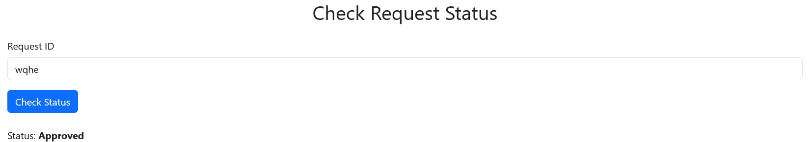
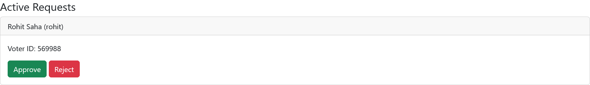
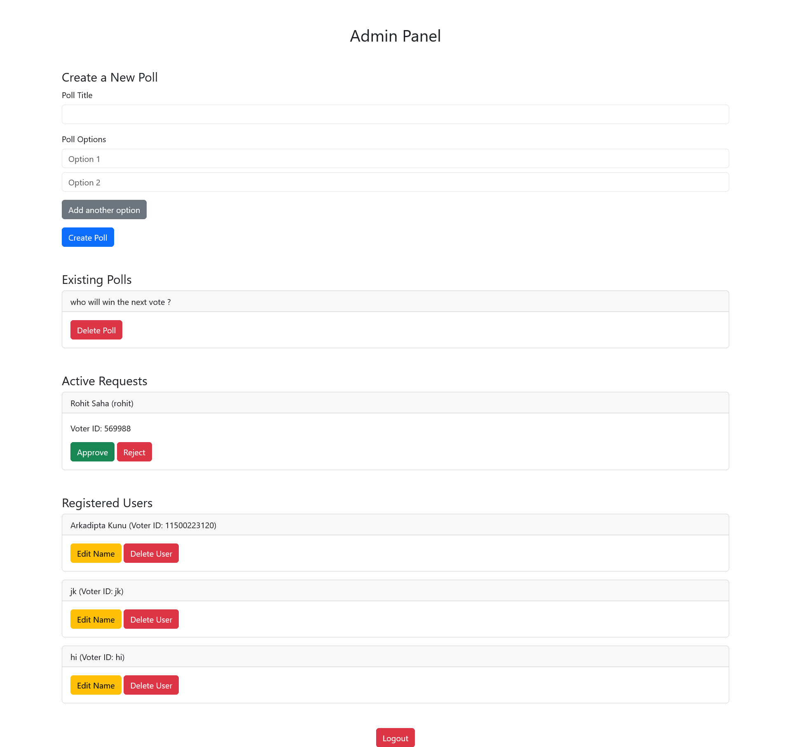

# Online Voting System

## Overview

The **Online Voting System** is a web-based application designed to facilitate online polls and voting. This system allows users to register, log in, vote on polls, and view voting results. Admin users can manage polls and registered users, including creating, deleting polls, and editing user information. The application leverages HTML, CSS, and JavaScript with data stored in the browser's local storage.



## Features

- **User Registration**: Users can register by providing their full name, voter ID, user ID, and password.
- **User Login**: Registered users can log in to cast their votes.
- **Voting System**: Users can vote on active polls and submit their votes.

- **Poll Management**: Admin users can create new polls, delete existing polls, and view voting results.

- **User Management**: Admin users can view registered users' information and delete users if necessary.

- **Prevent Multiple Votes**: Once a user votes on a poll, that poll is hidden from them to prevent duplicate voting.
- **Account Request Status**: Users can check the status of their account registration requests.

- **Registration Verification**: All registration requests are aproved through admin.

- **Compleate Admin Dashboard**

## Technologies Used

- **Frontend**: HTML, CSS (Bootstrap), JavaScript
- **Data Storage**: Local Storage (for user and poll data)

## Installation

To run the Online Voting System locally, follow these steps:

1. Clone this repository to your local machine:
   ```bash
   git clone https://github.com/Arkadipta-Kundu/voteingsystem.git
   ```

2. Navigate to the project directory:
   ```bash
   cd voteingsystem
   ```

3. Open the 

index.html

 file in your web browser.

## File Structure

```
voteingsystem/
│
├── index.html           # Landing page with voting results and navigation
├── login.html           # User login page
├── register.html        # User registration page
├── voting.html          # Voting page for logged-in users
├── admin.html           # Admin panel for managing polls and users
├── check-status.html    # Page to check account request status
```

## How to Use

1. **Register a User**:
   - Navigate to the **Register** page and fill out the registration form.
   - Click on the **Submit Request** button to create a new account request.
   - You will receive a Request ID to check the status of your account request.

2. **Check Account Request Status**:
   - Go to the **Check Status** page.
   - Enter your Request ID to see if your account request is pending, approved, or rejected.

3. **Log In**:
   - Go to the **Login** page and enter your user credentials.
   - Click the **Login** button to access the voting page.

4. **Vote on Polls**:
   - Once logged in, you will see the active polls.
   - Select an option and click the **Submit Vote** button.

5. **Admin Functions**:
   - Admins can log in with hardcoded credentials (User ID: [`admin`](command:_github.copilot.openSymbolFromReferences?%5B%22%22%2C%5B%7B%22uri%22%3A%7B%22scheme%22%3A%22file%22%2C%22authority%22%3A%22%22%2C%22path%22%3A%22%2FC%3A%2FUsers%2Farka2002%2FDesktop%2Fstudy%20files%2FVoteing%20System%2Fadmin.html%22%2C%22query%22%3A%22%22%2C%22fragment%22%3A%22%22%7D%2C%22pos%22%3A%7B%22line%22%3A57%2C%22character%22%3A24%7D%7D%2C%7B%22uri%22%3A%7B%22scheme%22%3A%22file%22%2C%22authority%22%3A%22%22%2C%22path%22%3A%22%2FC%3A%2FUsers%2Farka2002%2FDesktop%2Fstudy%20files%2FVoteing%20System%2Flogin.html%22%2C%22query%22%3A%22%22%2C%22fragment%22%3A%22%22%7D%2C%22pos%22%3A%7B%22line%22%3A39%2C%22character%22%3A29%7D%7D%2C%7B%22uri%22%3A%7B%22scheme%22%3A%22file%22%2C%22authority%22%3A%22%22%2C%22path%22%3A%22%2Fc%3A%2FUsers%2Farka2002%2FDesktop%2Fstudy%20files%2FVoteing%20System%2FREADME.md%22%2C%22query%22%3A%22%22%2C%22fragment%22%3A%22%22%7D%2C%22pos%22%3A%7B%22line%22%3A45%2C%22character%22%3A4%7D%7D%5D%2C%228f687fb6-7b1f-43cd-932a-d6f31768f177%22%5D "Go to definition"), Password: [`admin123`](command:_github.copilot.openSymbolFromReferences?%5B%22%22%2C%5B%7B%22uri%22%3A%7B%22scheme%22%3A%22file%22%2C%22authority%22%3A%22%22%2C%22path%22%3A%22%2FC%3A%2FUsers%2Farka2002%2FDesktop%2Fstudy%20files%2FVoteing%20System%2Flogin.html%22%2C%22query%22%3A%22%22%2C%22fragment%22%3A%22%22%7D%2C%22pos%22%3A%7B%22line%22%3A40%2C%22character%22%3A56%7D%7D%2C%7B%22uri%22%3A%7B%22scheme%22%3A%22file%22%2C%22authority%22%3A%22%22%2C%22path%22%3A%22%2Fc%3A%2FUsers%2Farka2002%2FDesktop%2Fstudy%20files%2FVoteing%20System%2FREADME.md%22%2C%22query%22%3A%22%22%2C%22fragment%22%3A%22%22%7D%2C%22pos%22%3A%7B%22line%22%3A64%2C%22character%22%3A80%7D%7D%5D%2C%228f687fb6-7b1f-43cd-932a-d6f31768f177%22%5D "Go to definition")).
   - Admins can create, delete polls and manage registered users from the admin panel.

## Contributions

Contributions are welcome! If you'd like to contribute to this project, please fork the repository and create a pull request with your changes.

## License

This project is licensed under the MIT License - see the LICENSE file for details.

## Acknowledgments

- Bootstrap for the responsive design.
- JavaScript for the client-side interactivity.

## Contact

For any questions or feedback, feel free to reach out to [arkadipta.dev@gmail.com](mailto:arkadipta.dev@gmail.com).